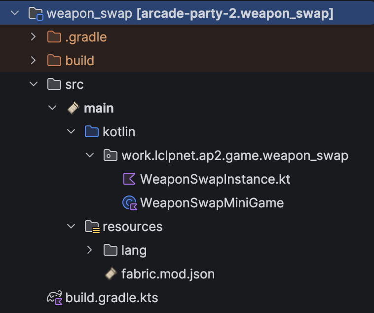

# Create a minigame
This teaches you what steps you need to follow in order to add a new minigame.

> **Note:** More information about minigames is available [here](/develop/basics/minigames.md).

## Using the TUI script
There is a Python TUI script available that can generate the basic setup for new minigames.
If you want to use it, you'll need the latest version of Python.

Initially, you'll need to set up a virtual environment:
```bash
python -m venv .venv
source .venv/bin/activate
pip install -r scripts/requirements.txt
```

After that, you can execute the TUI script:
```bash
python scripts/make_minigame.py
```

The script asks a series of questions to configure the new minigame:

| Prompt               | Description                                                                                                                                                       |
|----------------------|-------------------------------------------------------------------------------------------------------------------------------------------------------------------|
| **Minigame id**      | Unique identifier, lowercase letters and underscores only (e.g. `my_minigame`). Used for the module name, package and translation keys. Must not already exist.   |
| **Game name**        | The human-readable display name shown to players.                                                                                                                 |
| **Game description** | A short description of the game, shown to players.                                                                                                                |
| **Author**           | The author of the minigame, picked from the developers configured in `src/lib/src/main/resources/configuration.json`.                                             |
| **Game type**        | One of the four supported types (see below).                                                                                                                      |
| **Can be finale?**   | Whether this game is allowed to be played as the finale of a party. All games that set this to true must definitively have exactly one winner when they complete. |
| **Uses maps?**       | Whether the game runs on pre-built maps (see below).                                                                                                              |
| **Icon**             | A Minecraft item identifier used as the game's icon (e.g. `stone_bricks`), lowercase letters and underscores only.                                                |

After confirming the summary, the files are generated and the new module is registered in `settings.gradle`.

### Game type
The game type determines the base class the generated instance extends and the win-condition wiring:

| Type               | Description                                                              |
|--------------------|--------------------------------------------------------------------------|
| `ffa`              | Free-for-all. Every player competes individually and is ranked by score. |
| `ffa_elimination`  | Free-for-all where players are eliminated until a single winner remains. |
| `team`             | Team-based. Players are split into teams that are ranked by score.       |
| `team_elimination` | Team-based where teams are eliminated until a single team remains.       |

### Using maps
- **Yes** – The game runs on pre-built maps loaded at runtime. The instance extends a map-based base class (e.g. `FFAGameInstance`, `TeamGameInstance`) and is created through a `MapLevelGameFactory` / `MapLevelTeamGameFactory` that opens a random map. You will additionally be asked whether you want to scaffold a starter map (see below).
- **No** – The game runs on a freshly generated, empty level instead of a curated map. The instance implements `MiniGameInstance` directly, wires up its win manager through composables, and is created by a custom factory that calls `generateRandomLevel()` by default, but you an also change the logic to something different.

### Map options
When the game uses maps, you may optionally scaffold a starter map. If you confirm, you are asked for:

| Prompt          | Description                                                                     |
|-----------------|---------------------------------------------------------------------------------|
| **Map id**      | Identifier for the map, lowercase letters and underscores only (e.g. `my_map`). |
| **Map name**    | The display name of the map.                                                    |
| **Map authors** | One or more authors of the map (multi-select from the configured contributors). |
| **Map icon**    | A Minecraft item identifier used as the map's icon.                             |
| **Spawn**       | The spawn position as `x, y, z` integer coordinates.                            |

This creates the map entry under `run/assets/maps/ap2/<game_id>/` and registers `assets/maps` as a local map source in `run/config/ap2/config.json`. 
You still need to drop a `world.tar.xz` into the created versioned directory to provide the actual world data.

### Generated files
The script creates a self-contained module directory at `src/minigames/<game_id>/`.
The Kotlin sources live in that module under the package `work.lclpnet.ap2.game.<game_id>`.
The full structure within that director is:

| Path (relative to `src/minigames/<game_id>/`)                                       | Purpose                                                                                                                  |
|-------------------------------------------------------------------------------------|--------------------------------------------------------------------------------------------------------------------------|
| `build.gradle.kts`                                                                  | Gradle build configuration for the minigame module.                                                                      |
| `src/main/resources/fabric.mod.json`                                                | Fabric mod metadata. Registers the minigame's `MiniGame` class as the `ap2:minigame` entrypoint so it gets discovered.   |
| `src/main/resources/lang/en_us.json`                                                | English translations for the game's name and description.                                                                |
| `src/main/kotlin/work/lclpnet/ap2/game/<game_id>/<Game>MiniGame.kt`                 | The `MiniGame` definition: id, type, author, icon, finale eligibility and the factory used to create game instances.     |
| `src/main/kotlin/work/lclpnet/ap2/game/<game_id>/<Game>Instance.kt`                 | The game instance containing the actual gameplay logic. Implement `prepare()`/`go()` (map-based) or `start()` (mapless). |
| `src/main/kotlin/work/lclpnet/ap2/game/<game_id>/<Game>Factory.kt` *(mapless only)* | A custom `MiniGameFactory` that generates a level (and a team manager for team games) and constructs the instance.       |

In addition, the new module is appended to the `minigames` list in `settings.gradle`.
If a starter map was created, the corresponding files are written under `run/assets/maps/ap2/<game_id>/`.

After generation, refresh the Gradle project in your IDE to pick up the new module.

Your minigame source code should now look something like this:
