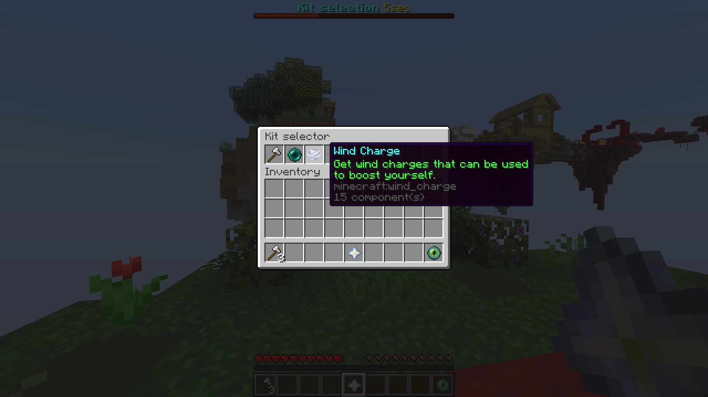
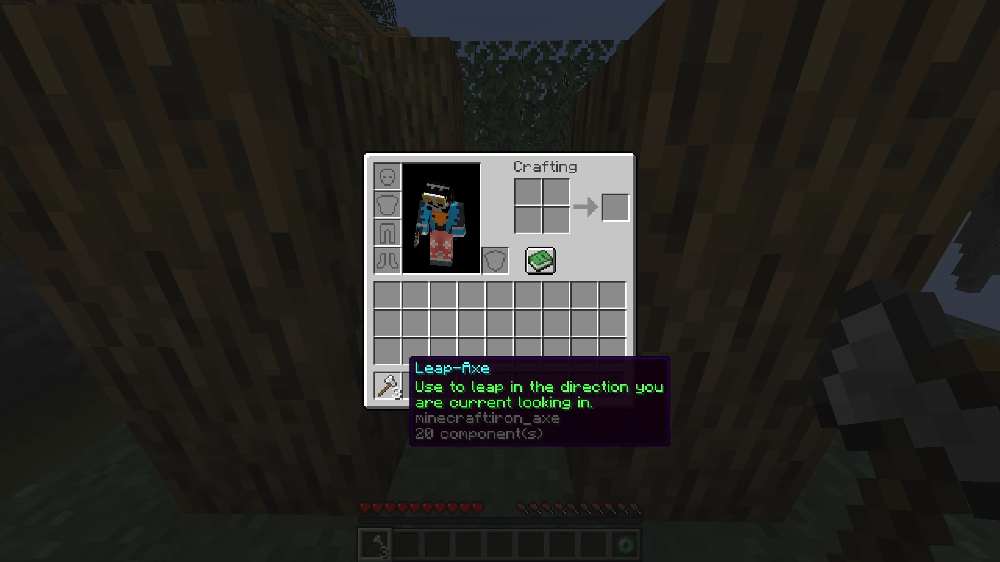

# Kits
Some minigames may want to provide different kits for players to play with.
A kit is a predefined loadout a player can pick.

## Kit Handler
All kit configuration is handled by the `KitHandler`.
On creation, all available kits are registered to the kit handler:

```kotlin
val kitHandler = KitHandler.create(gameHandle, level) { kitHandle ->
    listOf(
        LeapKit(kitHandle),
        EnderPearlKit(kitHandle, path),
        WindChargeKit(kitHandle)
    )
}
```

All kits are initialized with a `KitHandle`, providing necessary utils like [Hooks](/develop/developing-minigames/minigame-logic.md#hooks),
a [Scheduler](/develop/developing-minigames/minigame-logic.md#scheduler-tasks) or [translations](/develop/developing-minigames/translations.md).

Upon creation, the `KitHandler` has to be set up.
Usually this should happen within the `prepare()` function of a minigame:
```kotlin
override fun prepare() {
    kitHandler.setup()
}
```
This will:
- initialize each kit
- initialize player kit mapping
- register and enable the kit chooser item

After this has been called, players may change their kit using a kit selector item given to them.
Depending on the minigame, the kit selection may be disabled after an initial timer or on some other condition, such as leaving a designated area in-game.



## Creating a kit
Every kit has to implement the `Kit` interface:

```kotlin
interface Kit {
    fun id(): String

    fun createItemStack(manager: RegistryAccess): ItemStack

    fun init(options: KitOptions) {}

    fun equip(player: ServerPlayer, options: KitOptions) {}

    fun unequip(player: ServerPlayer, options: KitOptions) {}
}
```

Only two members are mandatory:
- `id()` returns a stable, unique string key for the kit. It drives the kit's translation keys (see [Kit names, icons and descriptions](#kit-names-icons-and-descriptions)) and must be unique within the minigame.
- `createItemStack(manager)` builds the item that represents the kit as an icon in the selector.

Other functions do nothing by default but can be overridden if custom behavior is needed.

Rather than implement `Kit` directly, most kits extend one of the convenience bases:

- `BaseKit(handle, id)` stores the `KitHandle` (as `handle`) and the `id`, and implements `id()` for you. Use it when the kit gives out more than a single item or manages its inventory by hand
- `SingleItemKit(handle, id, item, count)` extends `BaseKit` for the common case of a kit that is one item in the player's main slot. It implements `createItemStack`, `equip` (placing `count` of `item` in `options.mainItemSlot`), and `unequip` (clearing that slot). Override `configureItemStack(stack)` to add custom NBT or data components to the item

## The kit lifecycle
A kit goes through three stages:

- `init(options)` runs once for every registered kit, during `kitHandler.setup()`. Register your [hooks](/develop/developing-minigames/minigame-logic.md#hooks) and set up [scheduler](/develop/developing-minigames/minigame-logic.md#scheduler-tasks) tasks here, using the utilities on the `KitHandle` passed to the kit's constructor
- `equip(player, options)` runs whenever a player selects the kit, giving them its items
- `unequip(player, options)` runs whenever a player selects a different kit and the current kit has to be unequipped

Changing a kit always unequips the old kit before equipping the new one, so the two are symmetric: whatever `equip` hands out, `unequip` should take back. 
Every participant is assigned the first registered kit as their default during setup, which also triggers an initial `equip`.

Because `init` runs once but hooks fire for all players, a kit that needs per-player state keeps its own map. 
For example, `EnderPearlKit` tracks a refund task per thrown pearl in a `HashMap<UUID, TaskHandle>`.

## A complete example
The `LeapKit` from Dragon Escape is a `SingleItemKit`.
It gives the player an axe that launches them in the direction they are looking, with a limited number of uses and a cooldown.

```kotlin
private const val ID = "leap"
private const val USES = 3
private const val LEAP_STRENGTH = 1.8
private val ITEM: Item = Items.IRON_AXE
private val COOLDOWN_TICKS = Ticks.seconds(3)

class LeapKit(handle: KitHandle) : SingleItemKit(handle, ID, ITEM, USES) {

    override fun init(options: KitOptions) {
        PlayerInteractionHooks.USE_ITEM.registerWith(handle.hooks) { player, _, hand ->
            if (player !is ServerPlayer) return@registerWith InteractionResult.PASS

            val stack = player.getItemInHand(hand)

            if (stack.isOf(ITEM) && !player.cooldowns.isOnCooldown(stack)) {
                useItem(player, stack)
                return@registerWith InteractionResult.SUCCESS_SERVER
            }

            InteractionResult.PASS
        }
    }

    private fun useItem(player: ServerPlayer, stack: ItemStack) {
        stack.consume(1, player)
        player.cooldowns.addCooldown(stack, COOLDOWN_TICKS)

        VelocityModifier.setVelocity(player, player.lookAngle.scale(LEAP_STRENGTH))

        val world = player.level()

        SoundHelper.playSoundAt(player, SoundEvents.WITHER_SHOOT, SoundSource.PLAYERS, 0.5f, 1.8f)
        ParticleHelper.spawnParticleAt(player, ParticleTypes.CLOUD, 25, 0.2, 0.5, 0.2, 0.2)
    }
}
```

By extending `SingleItemKit`, the kit only has to describe its behavior: `equip`/`unequip` are inherited, and the hook registered in `init` reacts to the item being used. 

## Kit names, icons and descriptions
A kit's display name and lore come from [translations](/develop/developing-minigames/translations.md), keyed off the kit's `id()`. 
Using the [automatic key prefixing](/develop/developing-minigames/translations.md#automatic-key-prefixing) of your minigame, you provide these keys per kit:

- `kit.<id>`: the kit's name, shown on the icon and in the "kit selected" chat message
- `kit.<id>.description`: (optional) description shown on the icon in the selector menu
- `kit.<id>.hint`: (optional) usage hint description shown on the item once it is equipped in the player's inventory

For example, Dragon Escape's Leap kit defines:

```json
{
  "kit.leap": "Leap-Axe",
  "kit.leap.description": "Get an axe that leaps you in the current looking direction when used.",
  "kit.leap.hint": "Use to leap in the direction you are current looking in."
}
```

The description and hint are optional: if a key is missing, that lore is simply omitted. 
The icon shown in the selector is the item returned by the kit's `createItemStack`, which the handler decorates with the name and description automatically.

The hint of a kit can be seen in the player inventory:


## Controlling kit selection
`kitHandler.setup()` gives every participant the selector item and lets them change kits right away. 
From there, the minigame decides when selection is allowed, using methods on the `KitHandler`:

- `enableKitChanger()` / `enableKitChanger(player)` give the selector item and allow changing kits, for all participants or a single player
- `disableKitChanger()` / `disableKitChanger(player)` remove the selector item and block further changes
- `closeKitChanger()` / `closeKitChanger(player)` close the selector menu if it is open, without removing the item
- `startKitSelectionTimer(gameInstance, duration, onComplete)` makes players hold the selector and shows a countdown [timer](/develop/developing-minigames/minigame-logic.md#scheduler-tasks) for the given `duration`, running `onComplete` when it finishes. If fewer than two kits are registered, there is nothing to choose, so it skips the timer and runs `onComplete` immediately.
- `selectKitChanger()` forces players to hold the selector item; `selectKitItem()` switches them back to their main kit item (`options.mainItemSlot`)
- `reequip(player)` unequips and re-equips the player's current kit, useful after resetting a player's inventory

The typical free-for-all flow is: create the kit handler, call `setup()` in `prepare()`, start the selection timer and defer game start using `configureStartup()`, then lock things down in `go()` once the game begins:

```kotlin
override fun prepare() {
    kitHandler.setup()
}

override fun configureStartup(sequence: GameStartSequence) {
    val delay = KitHandler.DEFAULT_TIMER_DURATION
    kitHandler.startKitSelectionTimer(this, delay + sequence.initialDelay)
    sequence.extraDelay += delay

    super.configureStartup(sequence)
}

override fun go() {
    kitHandler.disableKitChanger()
}
```

`KitHandler.DEFAULT_TIMER_DURATION` is a shared default of 10 seconds.

Selection does not have to be time-based. 
Team games such as Paintball and Turf Wars let players re-pick a kit while inside their base, by toggling the changer as players enter and leave the area:

```kotlin
movementObserver.whenEntering(base) { player ->
    kitHandler.enableKitChanger(player)
}

movementObserver.whenLeaving(base) { player ->
    kitHandler.disableKitChanger(player)
}
```

If your minigame runs its own `USE_ITEM` hook that cancels item interactions, remember to let the selector through by checking `kitHandler.isKitSelector(stack)`.

## Querying the current kit
The `KitHandler` exposes its `KitManager` as `kitHandler.manager`, which tracks each player's current kit:

- `getKit(player)` returns the player's current kit (the default kit if none was chosen)
- `hasKitEquipped(player, kit)` checks whether the player has that specific kit
- `hasKitEquipped<T>(player)` is a reified extension that checks by kit type, handy when several players may share a base kit class
- `byId(id)` looks up a registered kit by its `id()`

For example, Turf Wars uses a type check to decide whether a melee hit is allowed, since only its Assassin kit may deal melee damage:

```kotlin
source.isOf(DamageTypes.ARROW)
    || (source.isOf(DamageTypes.PLAYER_ATTACK)
        && kitHandler.manager.hasKitEquipped<AssassinKit>(attacker))
```

Inside a kit, the same check is available directly on the `KitHandle` as `handle.hasKitEquipped(player, this)`, which is how `EnderPearlKit`, for example, ignores events for players who are not currently holding it.

## Kit options
`KitOptions` holds the inventory slots the handler works with:

```kotlin
data class KitOptions(val mainItemSlot: Int, val kitSelectorSlot: Int)
```

The default is `mainItemSlot = 0` (the first hotbar slot, where single-item kits place their item) and `kitSelectorSlot = 4` (the middle of the hotbar, where the selector item sits). 
To change them, call `modifyOptions` on the manager before `setup()`:

```kotlin
kitHandler.manager.modifyOptions { it.withKitSelectorSlot(8) }
```
