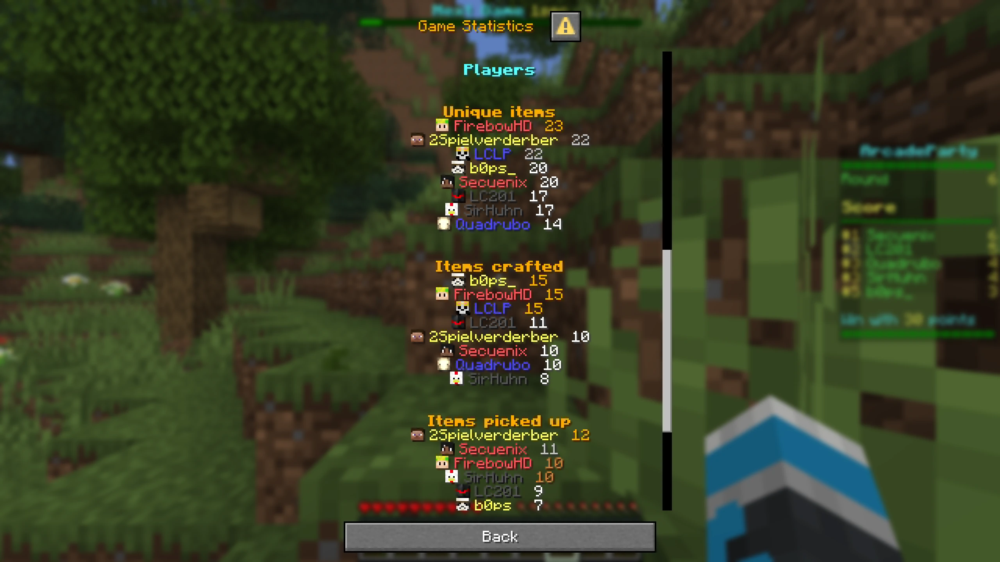

# Statistics
Alongside deciding who won, most minigames produce a handful of interesting numbers: how many blocks a
player broke, how much fuel a team added, how far everyone walked. The statistics system records those
numbers per subject while the game runs and shows them to players in an end-of-game summary.

A stat is a named value tracked for each subject (a player or a team). During the game the minigame feeds
values into a stats manager; when the game ends the framework freezes the manager, turns it into a result,
and hands that result to the session recorder, which powers the clickable "View stats" summary shown after
every game.

The statistics screen looks like this:


> **Note**: statistics are distinct from [data containers](/develop/developing-minigames/data-containers.md).
> The data container decides the *ranking* (who placed where); the statistics system records the *detail*
> behind that ranking. The two are connected: a score data container can feed its score straight into a stat
> (see [Feeding a stat from a data container](#feeding-a-stat-from-a-data-container)).

## The general idea
Working with statistics involves three steps:

1. **Define** the stats your game tracks as `Stat` descriptors.
2. **Register** them by handing them to `useFFAStats` (free-for-all) or `useTeamStats` (team games), which
   builds a stats manager and wires it into the [win manager](/develop/developing-minigames/minigame-logic.md).
3. **Record** values during play by calling `increment` / `modify` / `set` on that manager, keyed by the
   `ServerPlayer` or `Team` the value belongs to.

Everything after that (freezing at game over, building the result, storing it, and rendering the summary) is
handled by the framework.

## Defining a stat
A `Stat<T>` is an immutable descriptor of one tracked value. You do not store the value in it; you store it
as a top-level `val` and refer to it whenever you record or read the stat.

```kotlin
data class Stat<T>(
    val id: String,
    val default: T,
    val higherIsBetter: Boolean = true,
    val unit: StatUnit = StatUnits.Plain,
    val display: Boolean = true,
)
```

- `id`: a stable string key. It also drives the translation key used for the stat's label (see
  [How the display works](#how-the-display-works)).
- `default`: the starting value for every subject. The type `T` is inferred from it, so `Stat("kills", 0)`
  is a `Stat<Int>` and `Stat("accuracy", 0f)` is a `Stat<Float>`.
- `higherIsBetter`: whether a larger value ranks higher in the summary. Set it to `false` for stats where
  less is better, such as deaths or mistakes.
- `unit`: how the value is formatted for display (see [Stat units](#stat-units)).
- `display`: whether the stat gets its own section in the summary. A stat with `display = false` is still
  recorded, it is just not rendered (the synced score stat uses this, see below).

Stats are usually declared as top-level `val`s next to the game that uses them, and collected into a list
for registration:

```kotlin
val PlayersWeakened = Stat("players_weakened", 0)
val TimesWeakened = Stat("times_weakened", 0, higherIsBetter = false)
val TntDetonated = Stat("tnt_detonated", 0)
```

## Common stats
The library ships a set of ready-made stats in `CommonStats`. Reuse them instead of redefining the same
concepts, so their labels and formatting stay consistent across games.

| Stat                         | `id`             | Type     | Higher is better | Unit    |
|------------------------------|------------------|----------|------------------|---------|
| `CommonStats.IntScore`       | `score`          | `Int`    | yes              | plain   |
| `CommonStats.DoubleScore`    | `score`          | `Double` | yes              | plain   |
| `CommonStats.Kills`          | `kills`          | `Int`    | yes              | plain   |
| `CommonStats.Deaths`         | `deaths`         | `Int`    | no               | plain   |
| `CommonStats.KillDeathRatio` | `kd`             | `Float`  | yes              | plain   |
| `CommonStats.DamageDealt`    | `damage_dealt`   | `Float`  | yes              | plain   |
| `CommonStats.DistanceMoved`  | `distance_moved` | `Double` | yes              | plain   |
| `CommonStats.TimeSurvived`   | `time_survived`  | `Int`    | yes              | seconds |
| `CommonStats.BlocksPlaced`   | `blocks_placed`  | `Int`    | yes              | plain   |
| `CommonStats.BlocksBroken`   | `blocks_broken`  | `Int`    | yes              | plain   |

The common stats already have English labels in the library (`ap2.stat.<id>`), so you do not have to define
labels for them yourself.

Some of them have shared recording helpers so you do not have to wire up the events by hand:

- `trackDistanceMoved(stats)` registers a movement listener that accumulates `CommonStats.DistanceMoved` for
  every participant.
- `gainKill(player, stats)` increments `CommonStats.Kills`, plays a sound, and sends the player feedback.

Both live in `StatsExtensions.kt` and are extension functions on the minigame instance.

## Stat units
A stat's `unit` controls how its value is rendered in the summary. The built-in units are:

- `StatUnits.Plain` (the default): integers as-is, and floats/doubles formatted with two decimals.
- `StatUnits.Percent`: multiplies the value by 100 and appends `%`.
- `StatUnits.Seconds`: formats the value as a duration.

`StatUnit` is a functional interface, so you can pass your own formatter if none of the presets fit:

```kotlin
fun interface StatUnit {
    fun format(value: Any, player: ServerPlayer, translations: Translations): Component
}
```

## Registering stats
You do not construct a stats manager directly. 
Instead, you call one of the `use*` helpers, which builds the manager, deduplicates the stats by `id` and binds the manager to the win manager. 
The plain free-for-all helper takes just the stat list:

```kotlin
private val stats = useFFAStats(winManager, listOf(
    PlayersWeakened, TimesWeakened, TntDetonated
))
```

`useFFAStats` returns an `FFAStatsManager`, which is the object you record values on during the game. It is
keyed by `ServerPlayer`.

## Recording stats during gameplay
The manager exposes a small mutation API. 
Every call is keyed by the subject the value belongs to (a `ServerPlayer` for free-for-all and team-member stats or a `Team` for team totals):

- `increment(subject, stat, amount = 1)`: adds to an `Int` stat and returns the new value.
- `modify(subject, stat) { old -> new }`: updates a stat of any type from its previous value. Use it to
  accumulate `Float`/`Double` stats.
- `set(subject, stat, value)`: overwrites a stat with a value, for derived stats such as a kill/death ratio.
- `get(subject, stat)`: reads the current value.

All mutators are synchronized, and they become no-ops once the game ends and the manager is frozen, so a
late event firing after game over can never corrupt the final result.

## Feeding a stat from a data container
Score-based games already track a score in a [data container](/develop/developing-minigames/data-containers.md).
Rather than record that score twice, there is an overload of `useFFAStats` that syncs a score stat straight
from the container:

```kotlin
override val data = useDataContainer(::finaleCompatibleIntScoreContainer)
private val stats = useFFAStats(winManager, data, CommonStats.IntScore, allMiningBattleStats)
private val mbStats = MiningBattleStats(stats)
```

The score container implements `ScoreListenerView`, so the helper registers a listener on it and mirrors
every score change into the stats manager. It also copies the score stat with `display = false`, because the
score is already shown as the ranking detail next to each subject (the `toText` of the container's
`DataEntry`, for example `"12 points"`); rendering it again as its own stat section would be redundant. The
value is still recorded, which is what a future backend would read.

The result: your game keeps updating the data container as usual (`data.addScore(player, n)`), the score
appears in the ranking, and it is available as a stat without any extra code. Every other stat in the list
is recorded by your game as normal.

## Team stats
Team games register stats with `useTeamStats`, an extension on the minigame instance. Because a team game
has two levels of subject, it takes two stat lists: one tracked per team, and one tracked per individual
member.

```kotlin
override val stats = useTeamStats(
    winManager,
    teamStats = listOf(FuelAdded, FuelRemaining, Kills, Deaths, DamageDealt),
    playerStats = listOf(FuelAdded, Kills, Deaths, KillDeathRatio, DamageDealt)
)
```

`useTeamStats` returns a `TeamStatsManager`, which holds two independent managers:

- `stats.teams`: a manager keyed by `Team`, for team totals.
- `stats.players`: a manager keyed by `ServerPlayer`, for per-member stats.

Both expose the same `increment` / `modify` / `set` / `get` API as the free-for-all manager, so recording
works exactly as before. The usual pattern is to update both levels for each event, resolving a player's
team through the [team manager](/develop/developing-minigames/team-minigames.md#the-team-manager):

```kotlin
fun addFuel(player: ServerPlayer, team: Team, seconds: Float) {
    stats.players.modify(player, FuelAdded) { it + seconds }
    stats.teams.modify(team, FuelAdded) { it + seconds }
}

fun addDamage(attacker: ServerPlayer, amount: Float) {
    stats.players.modify(attacker, DamageDealt) { it + amount }

    teamManager.getTeam(attacker)?.let { team ->
        stats.teams.modify(team, DamageDealt) { it + amount }
    }
}
```

Just like the free-for-all helper, `useTeamStats` has a score-sync overload that takes the team score
container and a score stat, mirroring the team score into a hidden team stat.

> **Note**: team stats differ from player stats only in the subject type and the second parallel manager.

## How the display works
The framework handles the stats display automatically, however it is useful to understand the flow.

### From game over to a stored result
When the game ends, the win manager assembles the statistics for you:

1. It calls `fillDefaults` so every ranked subject has an entry (even those who never scored), then
   `freeze`s the manager so no more changes are accepted.
2. It builds a `GameSummary` with the game metadata (title, map or seed, Minecraft version, duration,
   participants) and a detail text per rank taken from the data container (for example `"12 points"`).
3. It calls the manager's `getResult(...)`, producing an `FFAStatsResult` or a `TeamStatsResult`, and hands
   it to `gameHandle.submitStats(...)`.

`submitStats` assigns the result a `UUID` and stores it in the `SessionStatsRecorder`. At the same time, the
win sequence posts a clickable "View stats" message in chat. Clicking it fires a custom action
(`ap2:show_stats`) carrying that `UUID`; the recorder looks the result up and opens the summary.

### The summary layout
The summary is rendered by `StatsDisplay` as a server dialog. It contains:

- A **header**: the game title, the map name (or the world seed, which players can click to copy), the
  Minecraft version, and how long the game lasted.
- An optional **ranking section**: each subject in placement order with its detail text (the score from the
  data container), colored by position.
- One **section per displayed stat**: subjects sorted by the stat's value, with the value formatted through
  the stat's `unit`.

Within a stat section, sorting honors `higherIsBetter`: for a stat where less is better (such as deaths) the
order is inverted, so the best value is always on top. Subjects with the same value share a rank, and the
next distinct value skips ranks (so a tie for first yields `1, 1, 3`). The top three positions are colored
gold, silver, and bronze. Stats with `display = false` (such as the synced score) are skipped entirely.

A team summary renders two categories, one ranking the teams and one listing the individual players, and
colors each player's name in their team color.

### Stat labels
A stat's label in the summary comes from a translation key derived from its `id`. For your own stats, add a
`stat.<id>` entry to your minigame's language files, using the same relative-key mechanism described in
[Using translations](/develop/developing-minigames/translations.md):

```json
{
  "stat.tnt_detonated": "TNT detonated",
  "stat.players_weakened": "Players weakened"
}
```

The common stats already provide their labels in the library (`ap2.stat.<id>`), which the display falls back
to when a game does not define its own. This means reusing `CommonStats.Kills` gives you a translated
"Kills" label for free.

## Future: submitting stats to a backend
Today the stats recorder keeps each game's result only for the duration of the session, purely to serve the
in-game "View stats" summary; once the session ends the results are gone.

The recorder is intended to be expanded so that recorded statistics can be **submitted to a backend server**.
That would let stats outlive a single session and enable persistent history, profiles, and leaderboards
across games.
